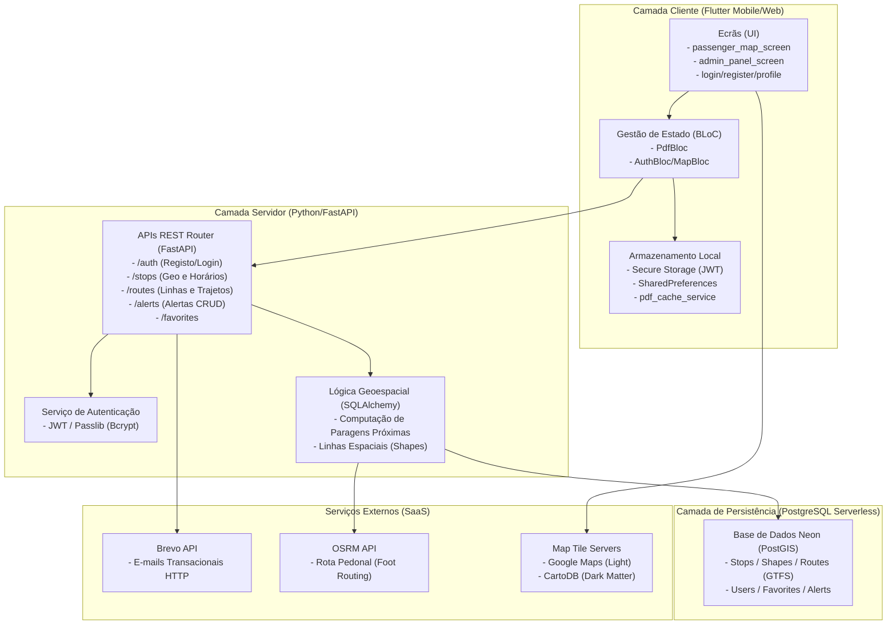
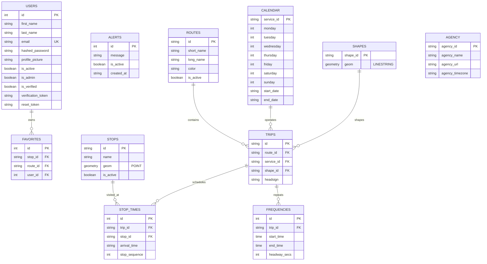

# Relatório do Projeto: Go with Mobilis

**Licenciatura em Engenharia Informática**  
**Autores**: Allice Victorio, Tiago Matias  
**Orientadora**: Professora Doutora Iolanda Bernardino  
*Leiria, julho de 2026*

---

## Resumo
O presente trabalho descreve o desenvolvimento e implementação do **Go with Mobilis**, uma solução tecnológica integrada desenhada para modernizar o acesso à informação e otimizar a experiência de utilização da rede de transportes urbanos Mobilis na cidade de Leiria. O projeto responde a limitações tradicionais sentidas pelos passageiros, como a consulta complexa de horários estáticos e a ausência de alertas de serviço em tempo real.

O objetivo principal consistiu na criação de um ecossistema digital composto por três componentes: uma aplicação móvel para o passageiro (Flutter/Dart com padrão BLoC), uma API backend segura (Python/FastAPI) e uma base de dados geoespacial na nuvem (PostgreSQL/PostGIS), estruturada segundo o padrão internacional GTFS (General Transit Feed Specification).

A nível de funcionalidades, a aplicação oferece visualização de rotas com mapas dinâmicos (Google Maps no modo claro e CartoDB no modo escuro), cálculo geográfico de paragens próximas via GPS, estimativa de tempos de chegada com contagens decrescentes reativas, favoritos sincronizados na nuvem e acesso offline a horários PDF através de um sistema de cache local. Disponibiliza ainda um painel móvel administrativo para monitorização de estatísticas, publicação e gestão de alertas de trânsito, e controlo rápido do estado de funcionamento de linhas e privilégios de utilizadores.

A solução foi alojada com sucesso em produção através de plataformas SaaS de deployment contínuo (Render para a API, Neon para a base de dados serverless, Brevo para e-mails transacionais e Netlify para serviços web secundários).

Como conclusão, o projeto atingiu a totalidade dos objetivos com elevado rigor técnico. A arquitetura demonstrou ser altamente segura — protegendo dados com tokens JWT e cofres criptográficos de hardware (Secure Storage) — e resiliente nos cálculos geográficos. O sistema encontra-se 100% online e operacional, comprovando a viabilidade de conceber uma plataforma profissional, sustentável e gratuita para a mobilidade inteligente de Leiria.

**Palavras-chave**: Mobilidade Urbana, GTFS, PostGIS, FastAPI, Flutter, SaaS, Sistemas de Informação Geográfica (SIG).

---

## Abstract
This paper describes the planning, development, and implementation of **Go with Mobilis**, an integrated and intelligent technological ecosystem designed to modernize information access and optimize the user experience within the Mobilis urban transit network in the city of Leiria, Portugal. The project emerged as a response to traditional daily challenges faced by passengers, such as complex paper-based timetable consultations, the absence of intuitive geographical navigation tools, and the lack of centralized, real-time transit alerts.

The primary objective of this work was to develop a cross-platform, high-performance digital ecosystem consisting of three core components: a passenger mobile application (developed in Flutter/Dart utilizing reactive state management via the BLoC pattern), a robust and secure backend Application Programming Interface (API) built with Python/FastAPI, and a cloud-hosted relational geospatial database (PostgreSQL with the PostGIS spatial extension) strictly modeled in compliance with the GTFS (General Transit Feed Specification) international transit data standard.

Regarding the implemented functionalities, the mobile client offers interactive maps powered by Google Maps (in Light Mode) and CartoDB (in Dark Mode) tile servers, user geolocalization to instantly calculate nearby stops within walking distance, estimated upcoming bus arrival timetables, a cloud-synchronized favorites system for routes and stops, and a resilient offline mode through local cache storage of official PDF transit guides. In addition to the passenger experience, the application features an advanced mobile administrative dashboard that enables the transit operator to monitor system statistics, publish instant traffic alerts, toggle route activity states, and manage user admin privileges directly from their smartphones.

The infrastructure of the final solution was successfully deployed to production using modern SaaS cloud platforms (Render for the API, Neon for the serverless database, Brevo for high-deliverability transactional email processing, and Netlify for secondary static web assets), establishing an automated continuous integration and continuous deployment (CI/CD) pipeline linked with a GitHub repository.

In conclusion, the project successfully achieved all proposed objectives with software engineering excellence. The deployed architecture proved to be highly secure — protecting user session credentials via server-side signed JWTs and client-side hardware-level encryption (Secure Storage) — and highly resilient in processing geographical and chronological data. The final system is 100% online and fully operational for continuous use, demonstrating the feasibility of designing a professional, sustainable, free, and privacy-focused solution that equips the city of Leiria with a robust tool for smart urban mobility.

**Keywords**: Urban Mobility, GTFS, PostGIS, FastAPI, Flutter, SaaS, Geographic Information Systems (GIS).

---

## 1. Introdução

O presente capítulo serve de enquadramento inicial à solução Go with Mobilis, apresentando o tema do trabalho, a sua justificação, os objetivos delineados, os métodos aplicados e a organização estrutural deste documento.

### 1.1. Justificação do Trabalho
Este trabalho consiste no desenvolvimento da solução Go with Mobilis, um ecossistema digital integrado constituído por uma aplicação móvel multiplataforma para passageiros (Flutter/Dart), uma API backend (Python/FastAPI) e uma base de dados geoespacial na nuvem (PostgreSQL/PostGIS) estruturada segundo a norma internacional de transportes GTFS.

A justificação deste tema reside na necessidade de modernizar o acesso à informação da rede de autocarros Mobilis em Leiria, substituindo tabelas horárias estáticas e PDFs complexos por uma consulta geográfica interativa. O projeto prima por uma filosofia académica de código aberto, sustentável e gratuita, assegurando independência de custos de SDKs proprietários pagos e foco na privacidade do utilizador.

### 1.2. Objetivos do Trabalho
O objetivo geral deste projeto consiste em desenvolver e colocar em produção uma plataforma integrada que centralize e georreferencie os horários, rotas e alertas da rede Mobilis, fornecendo uma consulta fluida em tempo útil a utilizadores passageiros e operadores administrativos.

**Objetivos Específicos:**
* Normalizar os dados de trânsito em conformidade com o padrão GTFS.
* Processar dados espaciais (paragens próximas e trajetos) eficientemente via base de dados PostGIS.
* Construir uma API REST assíncrona com autenticação segura por tokens JWT.
* Criar uma app móvel reativa (Android/iOS) com gestão de estado isolada via padrão BLoC.
* Garantir a resiliência offline através do armazenamento local de ficheiros PDF em cache.
* Disponibilizar uma consola móvel para que os administradores possam gerir alertas e monitorizar o estado das linhas em tempo real.

### 1.3. Métodos e Técnicas Utilizados
Para o desenvolvimento da solução, adotou-se o modelo de desenvolvimento ágil em formato monorepo para integração contínua do código. A segurança de dados assenta na cifragem bcrypt no servidor e no uso de cofres criptográficos de hardware (Secure Storage) nos telemóveis.

A infraestrutura cloud foi descentralizada em microsserviços SaaS gratuitos:
* **Render**: Plataforma de cloud hosting utilizada para alojar e executar a API backend (FastAPI), com suporte a deploys automáticos a partir do GitHub.
* **Neon**: Serviço de base de dados PostgreSQL serverless, responsável por alojar os dados geográficos (PostGIS) com escala automática e suspensão de atividade para otimização de recursos.
* **Brevo**: Plataforma de comunicação utilizada para o envio de e-mails transacionais (como ativação de contas) através de integração direta via API HTTP.
* **Netlify**: Serviço de alojamento e distribuição de conteúdos web, utilizado para publicar páginas estáticas associadas ao projeto.

---

## 2. Estado da Arte

O desenvolvimento da solução Go with Mobilis insere-se num contexto onde a mobilidade urbana é um dos principais desafios das cidades modernas. A eficácia dos transportes públicos depende diretamente da facilidade de acesso à informação digital.

### 2.1. Análise de Soluções de Mercado (Benchmarks)
Para situar o projeto, é necessário comparar as funcionalidades propostas com os líderes de mercado:

* **Google Maps / Apple Maps**: Plataformas de referência global integradas nativamente nos sistemas operativos. O Google Maps utiliza algoritmos de IA preditiva para sugerir rotas baseadas na eficiência energética e pegada de carbono. Apresentam elevada densidade de pontos de interesse, embora exibam por vezes lacunas na atualização em tempo real de pequenos operadores regionais em Portugal.
* **Moovit**: Maior agregador de dados de transporte do mundo. Baseia a eficácia na combinação de dados oficiais e informações de *crowdsourcing* da comunidade para reportar atrasos. Orienta o passageiro passo a passo com notificações sonoras de saída do autocarro.
* **Moov-u**: Solução verticalizada oficial de operadores da região (Rodoviária do Tejo, Oeste, Lis). Foca-se em transações diretas (passes e bilhetes via MB WAY). A informação provém diretamente do operador, fornecendo dados fidedignos para os utentes habituais.

### 2.2. Benchmarks Académicos
* **OneBusAway**: Plataforma académica open-source pioneira criada na University of Washington. Demonstra a separação de responsabilidades entre um servidor robusto que gerencia feeds GTFS em tempo real e aplicações cliente móveis.
* **Smart Campus (Universidade de Aveiro)**: Foca-se na monitorização da frota do campus universitário recorrendo a sensores IoT e painéis digitais nas paragens, eliminando o tempo de espera passivo.
* **Living Lab da Nova SBE**: Sistema de gestão de shuttles dinâmicos no campus de Carcavelos. Ajusta a frequência das viagens com base nos horários dos comboios da CP e no volume de passageiros.

### 2.3. Conclusões Comparativas

**Tabela 1. Resumo de Benchmarks Comerciais**

| Plataforma | Foco Principal | Grande Diferencial (2026) | Ponto Fraco / Limitação |
| :--- | :--- | :--- | :--- |
| Google/Apple Maps | Navegação Global | IA preditiva (eficiência energética). | Lacunas em operadores pequenos fora das grandes cidades. |
| Moovit | Transporte Público | Crowdsourcing e alertas em tempo real. | Interface focada em social/anúncios, com muito ruído visual. |
| Moov-u | Operadores Locais | Transação direta (compra de bilhetes). | Foco restrito a operadores específicos (Tejo, Oeste, Lis). |

**Tabela 2. Resumo de Soluções Académicas**

| Projeto | Instituição | Tecnologia Chave | Objetivo Principal |
| :--- | :--- | :--- | :--- |
| OneBusAway | Univ. Washington | Open-source / GitHub | Criar um padrão global para dados em tempo real. |
| Smart Campus | Univ. Aveiro | Sensores IoT em paragens | Eliminar o tempo de espera passivo dos alunos. |
| Living Lab | Nova SBE | Gestão de frotas dinâmica | Sincronizar autocarros (shuttles) com comboios da CP. |

---

## 3. Proposta de Solução

### 3.1. Lista de Requisitos

**Tabela 3. Requisitos Funcionais (RF)**

| ID | Descrição | Prioridade |
| :--- | :--- | :--- |
| APP-RF-01 | Permitir o registo e autenticação (login) de utilizadores com persistência segura. | Alta |
| APP-RF-02 | Apresentar visualização de linhas, horários e percursos sobre o mapa geográfico. | Alta |
| APP-RF-03 | Identificar e apresentar as paragens mais próximas com base no GPS do telemóvel. | Alta |
| APP-RF-04 | Permitir ao utilizador marcar e guardar linhas e paragens na lista de favoritos. | Média |
| APP-RF-05 | Exibir notificações e alertas contextuais em tempo real sobre o estado do serviço. | Alta |
| SYS-RF-01 | O servidor (Backend) deve fornecer APIs para consultas de horários, trajetos e paragens. | Alta |
| SYS-RF-02 | O servidor deve persistir as contas e favoritos sincronizados na nuvem. | Média |
| APP-RF-06 | Permitir o pedido de paragem digital ao veículo (*Mobile Stop Request*) - *Expansão futura*. | Baixa |
| APP-RF-07 | Emitir e validar título de transporte digital contactless - *Expansão futura*. | Baixa |

**Tabela 4. Requisitos Não Funcionais (RNF)**

| ID | Descrição | Prioridade |
| :--- | :--- | :--- |
| APP-RNF-PORT-01 | **Portabilidade**: Aplicação móvel desenvolvida de forma multiplataforma (Flutter/Dart). | Alta |
| APP-RNF-FIAB-01 | **Fiabilidade/Disponibilidade**: Permitir consultas de mapas e horários offline via cache. | Alta |
| SYS-RNF-DESEMP-01 | **Desempenho**: Processamento espacial instantâneo de proximidade na base de dados (PostGIS). | Alta |
| SYS-RNF-INTER-01 | **Interoperabilidade**: Estrutura relacional dos dados normalizada segundo o padrão GTFS. | Alta |
| SYS-RNF-PRIV-01 | **Privacidade**: Não rastrear dados pessoais dos utilizadores para fins comerciais. | Média |
| SYS-RNF-DESENV-01 | **Desenvolvimento**: Geração de documentação interativa automática do backend (Swagger). | Média |
| SYS-RNF-USAB-01 | **Usabilidade**: Interface digital silenciosa no autocarro para reduzir poluição sonora. | Baixa |

---

## 4. Casos de Uso e Especificação

O modelo de casos de uso capta as necessidades do utilizador e as interações com o sistema.

### 4.1. Identificação dos Atores
* **Passageiro (Ator Ativo)**: Utilizador que interage com a app Flutter para consultar horários, rotas e favoritos.
* **Servidor Backend (Ator Passivo/Externo)**: Sistema que gere a persistência, autenticação e computação de trajetos.

### 4.2. Especificação Textual dos Casos de Uso Críticos

**Tabela 5. Especificação do CASO DE USO 1**

| ID | CU-001 |
| :--- | :--- |
| **Nome** | Autenticar Passageiro |
| **Atores** | Passageiro, Servidor Backend |
| **Objetivo** | Iniciar sessão na aplicação para sincronizar os favoritos na nuvem. |
| **Pré-condições** | A aplicação está aberta e o dispositivo tem ligação à internet. |
| **Pós-condições** | O passageiro encontra-se autenticado e a sessão local ativa. |
| **Cenário Principal** | 1. O Passageiro clica em "Iniciar Sessão".<br>2. O sistema exibe o formulário de login.<br>3. O Passageiro preenche e-mail e palavra-passe.<br>4. O sistema valida as credenciais com o Backend (JWT).<br>5. O sistema sincroniza favoritos e redireciona. |
| **Cenários Alternativos** | **4.1. Credenciais inválidas**:<br>4.1.1. O sistema exibe "E-mail ou palavra-passe incorretos".<br>4.1.2. Aguarda nova submissão.<br>**4.2. Sem ligação**:<br>4.2.1. O sistema avisa do erro de rede e regressa ao modo offline. |

**Tabela 6. Especificação do CASO DE USO 2**

| ID | CU-002 |
| :--- | :--- |
| **Nome** | Adicionar Favoritos |
| **Ator** | Passageiro |
| **Objetivo** | Gravar uma linha ou paragem preferida para acesso rápido. |
| **Pré-condições** | O passageiro visualiza os detalhes da linha ou paragem. |
| **Pós-condições** | O elemento é adicionado aos favoritos do utilizador. |
| **Cenário Principal** | 1. O Passageiro clica no ícone de favorito.<br>2. O sistema verifica a autenticação.<br>3. O sistema guarda localmente e envia o pedido para a nuvem.<br>4. O sistema exibe confirmação. |
| **Cenários Alternativos** | **2.1. Passageiro não autenticado**:<br>2.1.1. O sistema redireciona para o login (<<include>>).<br>2.1.2. Após sucesso, retoma o fluxo.<br>**3.1. Modo Offline**:<br>3.1.1. Guarda apenas na cache local.<br>3.1.2. Exibe aviso de que será sincronizado ao detetar rede. |

---

## 5. Pesquisa e Comparativo de Tecnologias

### 5.1. Comparativo Técnico

#### Tecnologias para Frontend

**Tabela 7. Vantagens e Desvantagens de Android Nativo (Kotlin)**

| Vantagens | Desvantagens |
| :--- | :--- |
| Performance nativa máxima.<br>Acesso imediato a todas as APIs de sensores e hardware.<br>Bibliotecas oficiais robustas (Jetpack). | Curva de aprendizagem elevada.<br>Desenvolvimento restrito a Android, exigindo duplicação de esforço para iOS. |

**Tabela 8. Vantagens e Desvantagens de Flutter (Dart)**

| Vantagens | Desvantagens |
| :--- | :--- |
| Desenvolvimento multiplataforma a partir de um único código-base.<br>Hot Reload acelerando os testes.<br>Criação simplificada de layouts ricos com widgets reativos. | Tamanho final do pacote (.apk/.ipa) ligeiramente superior.<br>Camada de abstração que pode atrasar novas funções nativas específicas. |

#### Tecnologias para Backend

**Tabela 9. Vantagens e Desvantagens de Node.js (Express)**

| Vantagens | Desvantagens |
| :--- | :--- |
| I/O assíncrono muito rápido para consultas concorrentes.<br>Linguagem única (JavaScript/TypeScript) em toda a stack.<br>Manipulação simples e nativa de payloads JSON. | Fraco desempenho em processamento matemático e geográfico complexo.<br>Falta de validação estruturada nativa comparada ao Pydantic. |

**Tabela 10. Vantagens e Desvantagens de Python (FastAPI)**

| Vantagens | Desvantagens |
| :--- | :--- |
| Validação de dados automática e tipagem estática (Pydantic).<br>Geração automática da interface Swagger/OpenAPI.<br>Excelente ecossistema de bibliotecas geoespaciais e de ORM (SQLAlchemy). | I/O bruto ligeiramente inferior ao Node.js.<br>Maior consumo de memória em instâncias servidoras muito simples. |

#### Tecnologias para Base de Dados

**Tabela 11. Vantagens e Desvantagens de PostgreSQL (PostGIS)**

| Vantagens | Desvantagens |
| :--- | :--- |
| Processamento geográfico e espacial nativo otimizado.<br>Excelente integridade e consistência relacional.<br>Elevada escalabilidade para o modelo complexo do GTFS. | Instalação e configuração inicial mais exigentes.<br>Requer aprendizagem de comandos e funções SQL específicos do PostGIS. |

**Tabela 12. Vantagens e Desvantagens de MySQL**

| Vantagens | Desvantagens |
| :--- | :--- |
| Facilidade de instalação e ampla documentação de suporte.<br>Rápido para leituras simples de tabelas de horários estáticos. | Funções geoespaciais muito limitadas e lentas.<br>Perda de desempenho ao processar relações complexas de muitas tabelas. |

#### Tecnologias para API de Mapas

**Tabela 13. Vantagens e Desvantagens de Google Maps Platform**

| Vantagens | Desvantagens |
| :--- | :--- |
| Precisão total de arruamentos e dados de Leiria.<br>Interface familiar amplamente dominada pelos utilizadores.<br>Ferramentas prontas para marcadores e trânsito. | Custo financeiro elevado por mil consultas de mapa.<br>Rastreamento obrigatório de dados e dependência de chaves de API proprietárias. |

**Tabela 14. Vantagens e Desvantagens de OpenStreetMap (OSM) / CartoDB**

| Vantagens | Desvantagens |
| :--- | :--- |
| Utilização gratuita sem custos ou limites de tráfego.<br>Privacidade garantida (sem rastreamento pessoal).<br>Liberdade total para desenhar polylines e marcadores customizados. | Exige maior esforço de desenvolvimento para carregar e configurar camadas.<br>Detalhe rural ou de números de porta variável dependendo da comunidade. |

### 5.2. Decisões Finais e Justificação
* **Frontend**: Escolha do **Flutter (Dart)**, devido ao código-base único multiplataforma, fluidez de desenho de polylines a 60 FPS e isolamento de estado com o padrão BLoC.
* **Backend**: Opção pelo **FastAPI (Python)**, pela rapidez de escrita, validação Pydantic de dados e autodocumentação via Swagger.
* **Base de Dados**: **PostgreSQL + PostGIS**, justificado pelo rigor relacional da especificação GTFS e computação espacial na base de dados para cálculo de paragens próximas.
* **Mapas**: Integração híbrida via **flutter_map**, utilizando *tiles* de mapa do **Google Maps** (Light Mode) e **CartoDB Dark Matter** (Dark Mode). Esta escolha une a familiaridade visual dos utilizadores, a gratuidade dos servidores de azulejos rasterizados de rede e o suporte a cache local sem obrigatoriedade de SDKs proprietários ou custos comerciais.

---

## 6. Estruturação de Dados: O Padrão GTFS

Para garantir a interoperabilidade do sistema Go with Mobilis, a estrutura de dados foi desenhada em conformidade com a norma internacional **GTFS (General Transit Feed Specification)**.

O GTFS mapeia a rede através de ficheiros de texto estruturados:
* `stops.txt`: Coordenadas geográficas (`POINT`) e nomes das paragens.
* `routes.txt`: Dados das linhas (código, nome, cor oficial).
* `trips.txt`: Relação entre linhas e viagens efetuadas em horários específicos.
* `stop_times.txt`: Horários exatos de passagem em cada paragem ao longo de uma viagem.
* `calendar.txt`: Dias da semana e períodos de funcionamento da viagem.
* `shapes.txt`: Coordenadas sequenciais (`LINESTRING`) das ruas para desenhar as rotas no mapa.

### 6.1. O Desafio da Criação Manual de Dados
Durante o desenvolvimento, a ausência de um feed GTFS oficial disponibilizado pela operadora local exigiu que a equipa modelasse os dados de raiz. Para tornar o projeto exequível, limitou-se o âmbito às **linhas 1, 2 e 9**, que servem diretamente a **ESTG**. A extração de coordenadas exigiu verificação ponto a ponto via satélite no Google Maps, e os horários e trajetos foram transcritos manualmente para povoar os ficheiros estruturados. Este esforço assegurou dados reais e limpos e conformidade total com as normas internacionais.

---

## 7. Implementação da Solução

### 7.1. Camada Cliente (Mobile Frontend)

A aplicação foi estruturada de forma modular na diretoria `lib/`:
```
lib/
├── services/   # api_service.dart, location_service.dart, pdf_cache_service.dart
├── blocs/      # Business Logic (BLoC Pattern)
├── screens/    # passenger_map_screen.dart, admin_panel_screen.dart
└── main.dart   # Ponto de entrada
```

#### Gestão de Estado (BLoC Pattern)
O padrão **BLoC** (Business Logic Component) atua como intermediário, convertendo interações em eventos e emitindo estados estruturados à UI (`StateLoading`, `StateSuccess`, `StateError`). Isto separa a lógica de interface do processamento dos dados.

#### Integração Cartográfica e Geoespacial
A aplicação consome a biblioteca `flutter_map` configurada para carregar dinamicamente azulejos (tiles) do Google Maps (Light Mode) e CartoDB (Dark Mode).
A geolocalização utiliza o plugin `geolocator` para obter a posição GPS reativa. No mapa, desenham-se:
1. *Camada de Azulejos (Tiles)*: Visualização das vias.
2. *Camada de Percursos (Polylines)*: Linhas contínuas nas cores oficiais obtidas do GTFS (`LINESTRING`) e linhas tracejadas azuis para trajetos pedonais.
3. *Camada de Marcadores (Markers)*: Círculos brancos com bordas pretas representando as paragens intermédias do percurso.

#### Estrutura de Ecrãs
* **Ecrã Principal (`passenger_map_screen.dart`)**: Integra o mapa reativo com painéis deslizantes (`DraggableScrollableSheet`). Apresenta o tempo de espera do autocarro em contagem decrescente (atualizado a cada 15 segundos) e muda para o estado **"Em viagem"** e destino correspondente assim que o GPS indica que o utilizador chegou à paragem de embarque.
* **Autenticação e Perfil**: Formulários estilizados com tratamento JWT. O perfil permite sincronizar fotografias codificadas em base64.
* **Horários das Linhas**: Páginas específicas com tabelas cronológicas de passagem das Linhas 1, 2 e 9.
* **Leitor PDF Offline (`pdf_viewer_screen.dart`)**: Exibe panfletos oficiais da Mobilis, recorrendo a `pdf_cache_service.dart` para armazenamento físico persistente em cache, permitindo abertura instantânea em modo offline.
* **Painel Administrativo (`admin_panel_screen.dart`)**: Ecrã protegido por token JWT (requer `is_admin = true`). Implementa:
  1. *Estatísticas*: Consola com volume global de utilizadores e favoritos.
  2. *Linhas*: Lista de rotas com a possibilidade de as ativar/desativar em tempo real (Switch).
  3. *Utilizadores*: Filtro de pesquisa de contas e comutador para promoção a administrador.
  4. *Alertas (CRUD)*: Menu completo para criar, editar e eliminar avisos de serviço exibidos na Home de todos os utilizadores.

#### Explicação de Código: Gestão de Estado BLoC e Cache PDF
Para garantir resiliência offline, o fluxo de carregamento de horários em PDF utiliza a combinação do padrão **BLoC** e do serviço **`PdfCacheService`**. O código abaixo (retirado de `pdf_bloc.dart`) ilustra como o estado é gerido reativamente, com verificação de cache física local no dispositivo:

```dart
class PdfBloc extends Bloc<PdfEvent, PdfState> {
  PdfBloc() : super(PdfInitial()) {
    on<LoadPdfEvent>((event, emit) async {
      emit(PdfLoading());
      try {
        final lineName = event.lineShortName.replaceAll(RegExp(r'[a-zA-Z\s]'), '').trim();

        if (kIsWeb) {
          // No navegador (Web), verifica online se o PDF está acessível no backend
          final url = Uri.parse('${ApiService.baseUrl}/pdf/$lineName.pdf');
          final response = await http.head(url).timeout(const Duration(seconds: 5));
          if (response.statusCode == 200) {
            emit(PdfLoadedLocal(url.toString(), event.lineShortName));
          } else {
            throw HttpException('Horário não disponível no servidor.');
          }
          return;
        }

        // Em Android/iOS, verifica se o PDF já está em cache local
        final isCached = await PdfCacheService.isPdfCached(lineName);
        if (isCached) {
          final file = await PdfCacheService.getCachedPdfFile(lineName);
          emit(PdfLoadedLocal(file.path, event.lineShortName));
        } else {
          // Se não existir localmente, efetua o download e guarda na cache física
          final path = await PdfCacheService.downloadAndCachePdf(lineName);
          emit(PdfLoadedLocal(path, event.lineShortName));
        }
      } on SocketException catch (_) {
        emit(PdfError('Sem ligação à Internet. É necessária ligação de rede para efetuar o primeiro download deste horário.'));
      } catch (e) {
        emit(PdfError('Erro ao carregar o horário. Verifique a sua ligação.'));
      }
    });
  }
}
```

---

### 7.2. Camada Backend (Python/FastAPI)

Desenvolvido segundo especificações assíncronas assentes em Starlette e Pydantic.

#### Modelo de Dados GTFS (SQLAlchemy ORM)
Povoado através de transações de importação automatizadas (`import_all_gtfs.py`), o banco mapeia as paragens (PostGIS `POINT` SRID 4326) e trajetos (PostGIS `LINESTRING`).

#### Segurança e Tokens (JWT)
* Passwords encriptadas com **Passlib** (algoritmo **bcrypt**).
* Tokens **JWT** (algoritmo **HS256**) assinados pelo servidor contendo claims de utilizador. Os clientes móveis guardam o token cifrado recorrendo a chaves de hardware do telemóvel (**Android Keystore** e **iOS Keychain**) via `flutter_secure_storage`.

#### Serviço de E-mail Brevo (REST HTTP)
Para contornar o bloqueio de portas SMTP do Render, o módulo `email_service.py` deteta a chave `BREVO_API_KEY` e dispara pedidos HTTP POST estruturados direcionados à API oficial do Brevo. Este canal é responsável pelo envio de tokens de verificação e redefinição de password.

#### Infraestrutura Cloud
* **Render.com**: Alojamento do código FastAPI com Continuous Deployment (CD) direto a partir do GitHub.
* **Neon.tech**: Cluster PostgreSQL geográfico Serverless com auto-escalamento e conexão segura cifrada (`sslmode=require`).
* **Netlify**: Alojamento e deploy automático de interfaces estáticas web do ecossistema.

#### Explicação de Código: Computação Geoespacial com PostGIS
A funcionalidade mais crítica do backend é a determinação reativa de paragens a pé próximas do utilizador. Em vez de calcular distâncias em memória no servidor, a computação é delegada ao PostgreSQL/PostGIS.
O excerto de código abaixo (de `main.py`) ilustra como o backend converte as coordenadas GPS, aplica conversão geográfica e utiliza a função indexada **`ST_DWithin`** para limitar a busca a um raio de 500 metros:

```python
# 1. Converter coordenadas recebidas para elemento de Geometria POINT (SRID 4326)
target_point = WKTElement(f'POINT({lon} {lat})', srid=4326)

# 2. Calcular a distância em metros convertendo para a extensão genérica Geography
distance_col = func.ST_Distance(
    func.cast(models.Stop.geom, Geography),
    func.cast(target_point, Geography)
).label('distance')

# 3. Executar query SQL que filtra paragens a <= 500 metros e as ordena por proximidade
stops_query = db.query(
    models.Stop.id,
    models.Stop.name,
    func.ST_Y(models.Stop.geom).label('lat'),
    func.ST_X(models.Stop.geom).label('lon'),
    distance_col
).filter(
    func.ST_DWithin(
        func.cast(models.Stop.geom, Geography),
        func.cast(target_point, Geography),
        500  # Raio de busca limite em metros
    )
).order_by("distance").all()
```

---

### 7.3. Diagramas de Arquitetura e Dados

Para melhor ilustrar a organização do ecossistema **Go with Mobilis**, os diagramas abaixo descrevem a arquitetura lógica e a modelação relacional do banco de dados.

#### 7.3.1. Diagrama de Arquitetura Lógica do Sistema
A arquitetura assenta numa estrutura clássica de camadas descentralizadas, onde o cliente Flutter interage assincronamente com a API REST, que por sua vez gere a persistência e interage com serviços SaaS de suporte.



#### 7.3.2. Diagrama de Entidade-Associação (ERD) da Base de Dados
O esquema físico baseia-se na especificação relacional GTFS. As tabelas espaciais (`stops` e `shapes`) contêm campos de geometria geográfica processados via PostGIS. As tabelas de utilizadores, favoritos e alertas complementam a aplicação sem interferir na integridade do feed de trânsito.



#### 7.4. Modelação Matemática e Algorítmica

Para fundamentar as decisões de navegação e as estimativas temporais apresentadas ao utilizador, o ecossistema recorre a modelações matemáticas aplicadas tanto na API backend como na aplicação móvel.

##### 1. Distância Geodésica: A Fórmula de Haversine
Para calcular a distância linear real em metros entre duas coordenadas geográficas $(\text{Latitude, Longitude})$ à superfície da Terra, o sistema recorre à **Fórmula de Haversine**. Esta aproximação modela a Terra como uma esfera de raio médio $R = 6\,371\,000\text{ metros}$.

Dadas duas coordenadas $(\phi_1, \lambda_1)$ e $(\phi_2, \lambda_2)$ em radianos:
$$\Delta\phi = \phi_2 - \phi_1$$
$$\Delta\lambda = \lambda_2 - \lambda_1$$

O cálculo do coeficiente angular $a$ (a semi-corda do arco do grande círculo) é dado por:
$$a = \sin^2\left(\frac{\Delta\phi}{2}\right) + \cos(\phi_1) \cdot \cos(\phi_2) \cdot \sin^2\left(\frac{\Delta\lambda}{2}\right)$$

A distância angular central $c$ em radianos é calculada como:
$$c = 2 \cdot \operatorname{arctan2}\left(\sqrt{a}, \sqrt{1 - a}\right)$$

A distância final $d$ em metros é:
$$d = R \cdot c$$

Esta fórmula é executada no cliente Flutter através da classe `Distance` para:
* Determinar se o utilizador está a menos de **$20\text{ metros}$** de uma paragem (margem de tolerância física para marcar a paragem como "passada").
* Validar deslocamentos superiores a **$30\text{ metros}$** de forma a disparar uma nova query à API backend (mecanismo de *throttling* para poupar bateria e tráfego de rede).

##### 2. Conversão Cinemática de Tempo de Caminhada
A estimativa do tempo que o utilizador demora a pé até uma paragem baseia-se numa velocidade média padrão de caminhada humana de $v_{\text{walk}} = 4.8\text{ km/h}$.
Para simplificar a computação reativa no ecrã móvel, esta velocidade é convertida para metros por minuto:
$$v_{\text{walk}} = \frac{4800\text{ metros}}{60\text{ minutos}} = 80\text{ metros/minuto}$$

Assim, o tempo estimado de caminhada ($T_{\text{walk\_mins}}$) a partir de uma distância $d$ em metros é modelado pela função teto (para evitar estimativas de zero minutos):
$$T_{\text{walk\_mins}} = \left\lceil \frac{d}{80} \right\rceil$$

##### 3. Função de Custo para Escolha da Rota Ótima
Ao solicitar um plano de navegação entre duas coordenadas, o backend avalia múltiplas combinações de viagens. A seleção da melhor alternativa é modelada por uma **função de custo** linear simples ($S_{\text{total}}$) em segundos, que o algoritmo tenta minimizar:
$$\min \left( S_{\text{total}} \right) = T_{\text{espera}} + T_{\text{viagem}} + T_{\text{caminhada}}$$

Onde:
* $T_{\text{espera}} = T_{\text{partida\_autocarro}} - T_{\text{procura}}$: Segundos que o passageiro espera na paragem de embarque.
* $T_{\text{viagem}} = T_{\text{desembarque}} - T_{\text{embarque}}$: Segundos que o passageiro passa dentro do autocarro.
* $T_{\text{caminhada}} = \frac{d_{\text{origem}}}{1.4} + \frac{d_{\text{destino}}}{1.4}$: Segundos que o utilizador passa a caminhar (utilizando uma velocidade padrão mais rigorosa de $1.4\text{ m/s} \approx 5.04\text{ km/h}$).

##### 4. Divisão Euclidiana para Formatação de Horas
Para manipular horários na API FastAPI, todas as horas são convertidas para objetos `timedelta` do Python, representando os segundos acumulados desde a meia-noite ($00:00:00$).
O cálculo para reverter estes segundos inteiros ($S$) de volta para uma string formatada em `HH:MM:SS` utiliza o algoritmo da divisão euclidiana (divisão inteira $\lfloor \cdot \rfloor$ e operador módulo $\bmod$):
$$\text{Horas} = \lfloor \frac{S}{3600} \rfloor$$
$$\text{Resto}_1 = S \bmod 3600$$
$$\text{Minutos} = \lfloor \frac{\text{Resto}_1}{60} \rfloor$$
$$\text{Segundos} = \text{Resto}_1 \bmod 60$$

##### 5. Aritmética de Frequências (Headway)
Para viagens que operam em regime de frequência (definido na tabela `frequencies` do GTFS), o horário oficial não é estático. O backend calcula as partidas subsequentes aplicando progressões aritméticas.
Dado um tempo de partida base $T_{\text{base}}$ e um intervalo entre autocarros (headway) em segundos $H$, a partida de ordem $k$ é dada por:
$$T_k = T_{\text{base}} + k \cdot H, \quad \text{com } T_k \le T_{\text{fim\_serviço}}$$
O backend percorre este ciclo incrementando $k$ até encontrar as três próximas partidas válidas superiores ao tempo de pesquisa atual do utilizador.

---

## 8. Implementações Futuras

### 8.1. Pedido de Paragem Digital (*Mobile Stop Request*)
Possibilidade de o passageiro sinalizar ao motorista a intenção de sair na próxima paragem através do telemóvel, promovendo a acessibilidade e evitando o contacto físico com os botões tradicionais (higiene e biossegurança).
* **Wi-Fi do Veículo (Captive Portal)**: Ligação rápida a uma página de controlo local ao entrar no autocarro.
* **QR Codes**: Afixados nas costas dos bancos para ativação instantânea sem instalar aplicações.
* **Beacons Bluetooth**: Transmissores de baixa energia detetados pela app móvel ao entrar no autocarro, ativando o botão de paragem dinamicamente.
* **Driver Dashboard**: Interface dedicada no posto de condução do motorista para visualização dos alertas visuais de paragem silenciosos.

### 8.2. Validação Contactless de Títulos de Transporte
Integração de passes desmaterializados diretamente na aplicação.
* **Tecnologia NFC**: Permite validar o passe aproximando o telemóvel do leitor (semelhante a cartões bancários).
* **QR Codes Dinâmicos**: Códigos gerados na app que mudam a cada poucos segundos para prevenir fraudes, lidos por scanner no autocarro.
* **Bluetooth Hands-Free**: Validação automática por proximidade sem necessidade de retirar o telemóvel do bolso.

---

## 9. Validação e Testes

Para garantir a qualidade, robustez e conformidade da plataforma, foi executado um plano estruturado de validação lógica e funcional.

### 9.1. Testes de Consistência de Dados e Integridade (Backend)
Antes do povoamento em produção, os dados GTFS recolhidos manualmente foram validados através de scripts automatizados de consistência:
* **Script `import_all_gtfs.py`**: Garante que todas as referências de chaves estrangeiras entre as tabelas `stops`, `trips`, `routes` e `stop_times` são válidas, abortando a transação em caso de paragens inexistentes ou horários órfãos.
* **Script `generate_map_check.py`**: Gera um ficheiro HTML interativo (`check_stops.html`) que projeta as coordenadas inseridas na base de dados diretamente sobre o mapa real, permitindo a validação visual da posição física exata das paragens e traçados em Leiria antes do deployment.

### 9.2. Testes Funcionais e Cenários de Integração (Manual)
Foram executados testes de caixa preta com simulação de hardware nos emuladores e dispositivos reais:
* **Fluxo de Autenticação JWT e Segurança**: Validou-se que tokens JWT corrompidos ou expirados são rejeitados de imediato pelo middleware do FastAPI. Confirmou-se que apenas utilizadores promovidos a administradores (`is_admin = true`) conseguem acesso ao painel de gestão.
* **Geolocalização e Proximidade Reativa**: Utilizando ferramentas de simulação de rota GPS (GPX playback), testou-se o comportamento do mapa em movimento. O sistema identificou com sucesso a chegada à paragem de embarque, modificando instantaneamente o painel de navegação para o modo de acompanhamento **"Em viagem"**.
* **Comportamento Resiliente Offline**: Simulou-se a perda total de rede de dados (modo avião). A aplicação foi capaz de carregar e ler os horários em formato PDF previamente guardados no sistema de ficheiros local (`pdf_cache_service`), informando devidamente o utilizador sobre a indisponibilidade de atualizar favoritos na nuvem sem gerar falhas críticas (*crashes*).
* **Comutação de Map Tiles (Modos Claro e Escuro)**: Validou-se que a transição estética da aplicação altera corretamente o servidor de azulejos raster (Google Maps Tiles para o modo claro, CartoDB Dark Matter para o modo escuro) sem fugas de memória ou degradação na taxa de fotogramas (mantendo-se a 60 FPS).

---

## 10. Conclusão

O desenvolvimento da solução **Go with Mobilis** atingiu com sucesso todos os objetivos propostos para o desenvolvimento deste projeto informático. O ecossistema concebido provou ser uma resposta tecnológica viável, integrando de forma harmoniosa aplicações móveis modernas (Flutter), processamento de dados geoespaciais em tempo real (PostgreSQL/PostGIS) e infraestruturas escaláveis e económicas na nuvem (FastAPI alojado em Render e Neon serverless).

O maior desafio técnico do projeto residiu na **ausência de um feed GTFS oficial por parte do operador local**. A equipa superou este obstáculo ao modelar os dados de raiz de forma manual para as linhas críticas que servem o campus da ESTG/IPLeiria (Linhas 1, 2 e 9). Este esforço permitiu compreender em profundidade a especificação internacional e implementar algoritmos eficientes baseados em geometria matemática.

Por fim, o projeto estabelece uma base sólida para futuras expansões em mobilidade inteligente (como paragens silenciosas via NFC/Bluetooth e bilhética contactless), demonstrando a viabilidade de conceber aplicações com qualidade profissional assentes em filosofias de código aberto e foco estrito na privacidade dos passageiros de Leiria.
